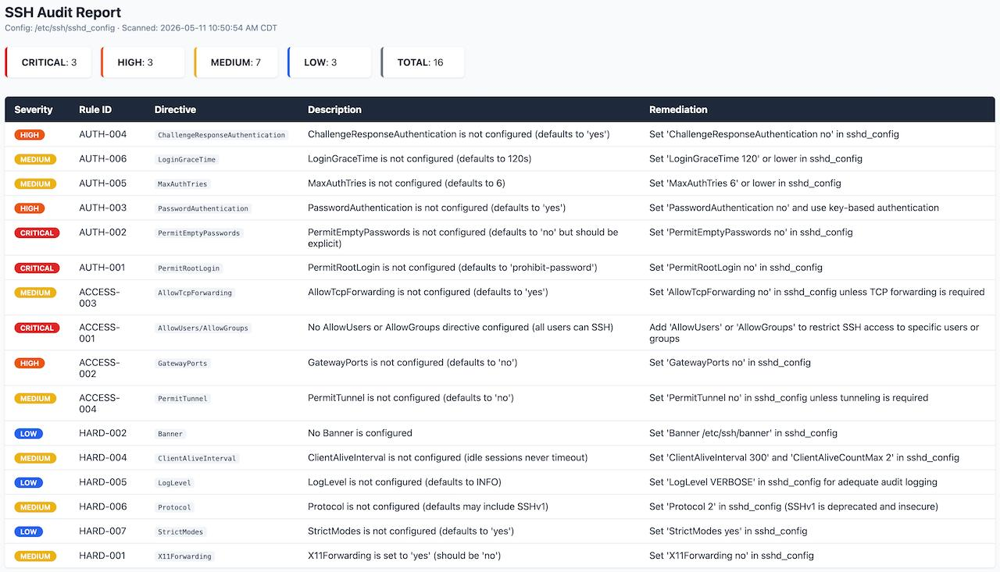

# SSH Hardening Auditor

A command-line tool that scans `sshd_config` files against security best practices and CIS benchmarks. Reports findings with severity levels, descriptions, and actionable remediation steps.

## Features

- **23 security rules** across authentication, cryptography, access control, and hardening
- **CIS benchmark mapping** — every rule references its CIS SSH configuration control
- **Severity classification** — critical, high, medium, low with color-coded output
- **Multiple report formats** — terminal (Rich tables), JSON, and HTML
- **Config parser** — handles case-insensitive directives, comments, `Include` paths, and `Match` blocks
- **Zero system dependencies** — only Python 3.10+ with `typer` and `rich`

## Installation

### From source (recommended)

```bash
cd ssh-auditor
python3 -m venv venv
source venv/bin/activate
pip install -e ".[dev]"
```

### System-wide (optional)

```bash
pip install -e .
# Now available as: ssh-auditor scan /etc/ssh/sshd_config
```

## Usage

### Scan a config file (terminal output)

```bash
./venv/bin/python -m ssh_auditor.cli scan /etc/ssh/sshd_config
```

### Export as JSON

```bash
./venv/bin/python -m ssh_auditor.cli scan /etc/ssh/sshd_config --format json
./venv/bin/python -m ssh_auditor.cli scan /etc/ssh/sshd_config --format json --output report.json
```

### Export as HTML

```bash
./venv/bin/python -m ssh_auditor.cli scan /etc/ssh/sshd_config --format html --output report.html
```

### List all audit rules

```bash
./venv/bin/python -m ssh_auditor.cli rules
```

### Exit codes

| Code | Meaning |
|------|---------|
| `0`  | Config is compliant (no critical or high findings) |
| `1`  | One or more issues found |

## Demo

### Terminal Output



*Example: scanning `/etc/ssh/sshd_config` and reporting 16 findings across all severity levels.*

## Audit Rules

### Authentication (AUTH-001 to AUTH-007)

| Rule ID | Severity | Check |
|---------|----------|-------|
| AUTH-001 | CRITICAL | PermitRootLogin must be `no` |
| AUTH-002 | CRITICAL | PermitEmptyPasswords must be `no` |
| AUTH-003 | HIGH | PasswordAuthentication should be `no` (key-only preferred) |
| AUTH-004 | HIGH | ChallengeResponseAuthentication should be `no` |
| AUTH-005 | MEDIUM | MaxAuthTries should be ≤ 6 |
| AUTH-006 | MEDIUM | LoginGraceTime should be ≤ 120 seconds |
| AUTH-007 | LOW | UsePAM should be `yes` |

### Cryptography (CRYPTO-001 to CRYPTO-005)

| Rule ID | Severity | Check |
|---------|----------|-------|
| CRYPTO-001 | HIGH | 3DES-CBC must NOT be in Ciphers list |
| CRYPTO-002 | HIGH | CBC-mode ciphers are vulnerable to padding oracle attacks |
| CRYPTO-003 | MEDIUM | Weak key exchange (DH group1, group14-sha1) must not be used |
| CRYPTO-004 | MEDIUM | DSA host keys (ssh-dss) are deprecated |
| CRYPTO-005 | LOW | Prefer Ed25519 or RSA (SHA-2) host key algorithms |

### Access Control (ACCESS-001 to ACCESS-004)

| Rule ID | Severity | Check |
|---------|----------|-------|
| ACCESS-001 | CRITICAL | AllowUsers or AllowGroups should be configured |
| ACCESS-002 | HIGH | GatewayPorts must be `no` |
| ACCESS-003 | MEDIUM | AllowTcpForwarding should be `no` unless needed |
| ACCESS-004 | MEDIUM | PermitTunnel should be `no` unless needed |

### Hardening (HARD-001 to HARD-007)

| Rule ID | Severity | Check |
|---------|----------|-------|
| HARD-001 | MEDIUM | X11Forwarding should be `no` |
| HARD-002 | LOW | Banner should be configured |
| HARD-003 | LOW | PrintMotd should be `no` |
| HARD-004 | MEDIUM | ClientAliveInterval should be > 0 (idle session timeout) |
| HARD-005 | LOW | LogLevel should be VERBOSE or INFO (not QUIET) |
| HARD-006 | MEDIUM | Protocol must be 2 only (no SSHv1) |
| HARD-007 | LOW | StrictModes should be `yes` |

## Architecture

```
ssh-auditor/
├── ssh_auditor/
│   ├── __init__.py           # Package version
│   ├── cli.py                # Typer CLI entry point (scan, rules)
│   ├── parser.py             # sshd_config file parser (stdlib only)
│   ├── evaluator.py          # Rule loader, checker, summary generator
│   ├── rules/                # Audit rule definitions
│   │   ├── base.py           # Rule base class, Finding dataclass, Severity enum
│   │   ├── auth.py           # Authentication rules (7)
│   │   ├── crypto.py         # Cryptography rules (5)
│   │   ├── access.py         # Access control rules (4)
│   │   └── hardening.py      # General hardening rules (7)
│   └── reporter/             # Report generators
│       ├── json_report.py    # JSON report generation
│       └── html_report.py    # HTML report generation with severity color-coding
├── tests/
│   ├── conftest.py           # Pytest fixtures (sample configs)
│   ├── test_parser.py        # Parser unit tests (13 tests)
│   ├── test_auth_rules.py    # Auth rule tests (18 tests)
│   ├── test_crypto_rules.py  # Crypto rule tests (10 tests)
│   └── test_rules.py         # Access + hardening rule tests (28 tests)
│   └── fixtures/             # Sample sshd_config files
│       ├── sshd_config_good.conf   # CIS-compliant baseline
│       ├── sshd_config_bad.conf    # Intentionally insecure (21 findings)
│       └── sshd_config_mixed.conf  # Partially hardened (test edge cases)
├── pyproject.toml            # Project metadata, dependencies, entry point
└── README.md                 # This file
```

## Development

### Running tests

```bash
./venv/bin/pytest tests/ -v
./venv/bin/pytest tests/ --cov=ssh_auditor --cov-report=term-missing
```

### Adding a new rule

1. Create a new file in `ssh_auditor/rules/` (or add to an existing category)
2. Subclass `Rule` from `ssh_auditor.rules.base`:

```python
from ssh_auditor.rules.base import Rule, Finding, Severity

class MyNewRule(Rule):
    rule_id = "CATEGORY-XXX"
    severity = Severity.MEDIUM
    description = "What this rule checks"
    remediation = "How to fix it"
    cis_reference = "CIS X.Y.Z"

    def check(self, directives):
        findings = []
        # Access directives via: [d for d in directives if d['directive'] == 'MyDirective']
        # Return list of Finding() objects (empty if compliant)
        return findings
```

3. Add the rule class to `evaluator.py`'s import list (or use auto-discovery)
4. Write tests in `tests/test_<category>_rules.py`

### Project dependencies

| Package | Purpose |
|---------|---------|
| `typer` | CLI framework (lightweight, auto-help generation) |
| `rich` | Terminal formatting (tables, panels, color output) |
| `pytest` | Testing framework |

No other external dependencies — the parser uses only Python stdlib (`re`, `pathlib`).

## License

MIT
